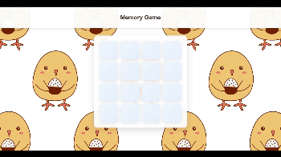
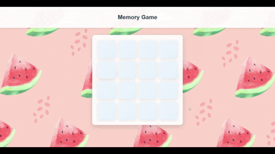

# Memory Game

A simple web-based matching pairs game implemented in two versions - a text-based version and an image-based version with the same 4x4 grid gameplay.

## Description

This memory game challenges players to find matching pairs of cards in a 4x4 grid. The game has two implementations:

- **Version 1 (index1.html)**: Minimalist design using text-based cards
- **Version 2 (index2.html)**: Enhanced version with image cards

## How to Play

1. Click on any card to reveal its content
2. Click on a second card to find a match
3. If the cards match, they remain visible
4. If they don't match, they flip back over
5. Continue until all pairs are found
6. A congratulation message appears when you win
7. You can choose the option to play again and all cards shuffle

## Demo Videos

### Version 1 (Text-based)

### Version 2 (Image-based)

## Technologies Used

- HTML
- CSS
- JavaScript
- WebP images for optimized performance

## Project Structure

- `index1.html` - Text-based version
- `index2.html` - Image-based version
- `program1.js` / `program2.js` - Game logic
- `styles1.css` / `styles2.css` - Styling
- `img/` - Directory containing card images

## Future Improvements

- Score tracking
- Timer functionality
- Difficulty levels
- Sound effects
